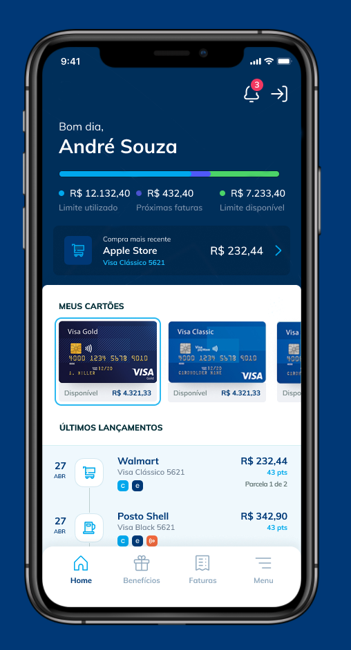

# Aplicativo Desafio GS3 para Desenvolvedores Frontend

## Requerimentos
- Node >= 14
- Ionic V6

Obs: Para checagem de versões `npx ionic info`, recomendado execução após `npm install`

## Rodar o app no browser

1. `npm install -g @ionic/cli`
2. Clonar o reposório, [disponível neste link](https://gitlab.com/gs3tecnologia/desafio-gs3-css) e fazer um "fork" para sua conta
3. `npm install`
4. `npx ionic serve`
5. Realizar as atividades do desafio proposto
6. Ao final do trabalho, compartilhar o código-fonte com a equipe da GS3

## Desfio Nível 1
Aplicar no código-fonte existente o layout proposto na imagem abaixo. Favor atentar-se às cores utilizadas, ao scroll horizontal dos cartões e ao gráfico.

## Desfio Nível 2
1. Adicionar uma tab (Menu) com algum ícone padrão do ionic.
2. Mudar o ícone da tab para a versão "outline" quando o mesmo não estiver selecionado. 

## Desfio Nível 3
1. Colocar o "badge" de notificação no ícone do canto superior direito da tela.
2. Carregar os dados da tela por meio do arquivo json que está na pasta src/data/mock.json (Observação: no código atual os dados estão estáticos).

## Imagem proposta para os desafios

